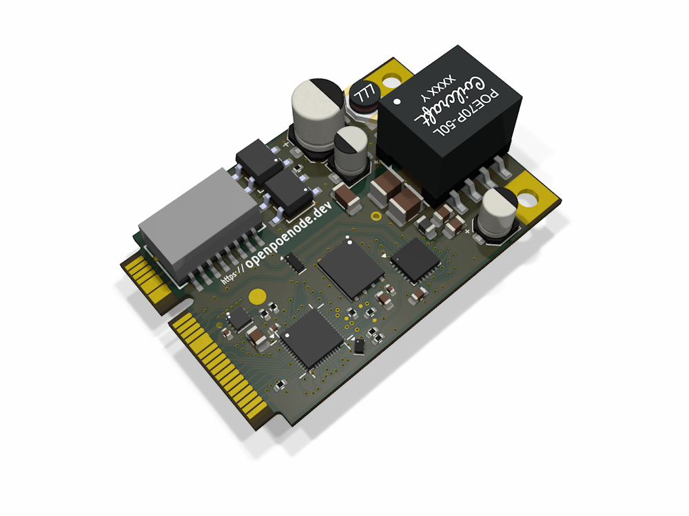

# The openPoeNode platform

...is an open reference implementation for PoE-powered embedded nodes—ready to be integrated, reducing your project's development time and risk.  

## What

This project revolves around the [openPoeNode module](https://github.com/openpoenode/module), which combines:

- an ESP32-D0WD-V3 microcontroller,
- 16 MB of NOR flash,
- 4 MB of PSRAM,
- 10/100 Mbit Ethernet connectivity,
- a Power-over-Ethernet (802.3af) interface, and
- a 7 W isolated DC/DC converter

into a compact form factor (45 × 30 mm) **reusable building block** with a standard connector interface.

The module is complemented by several carrier board reference designs and a [KiCad library](https://github.com/openpoenode/library) for frictionless project bootstrapping.

Among the featured carrier boards, the [Breakout Board](https://github.com/openpoenode/breakoutboard) enables integrators to fully evaluate all features of the openPoeNode module.

## Why

In the realm of PoE-powered IoT devices, when starting a new project, probably **90% of the effort is spent** repeatedly spinning up the infrastructure: MCU with memory, communications and power supply. Schematics, PCB layout, component selection, sourcing, and testing all consume significant time, money, and resources that are better used elsewhere.

By designing around the openPoeNode module, you:

- **cut time** to a first working prototype **from months to days**
- **avoid surprises** in parts of the layout you are not even interested in
- can design for much **lower-spec PCB parameters** than usually required for high-speed MCUs/communications

> Building your IoT device with openPoeNode allows you to cut right to the chase of your application.

## Who

This module is intended for:

- Embedded engineers building Ethernet-based IoT devices
- System integrators working with building or industrial automation
- Small OEMs developing PoE-powered products
- Developers who want to skip PoE + Ethernet hardware design efforts

Typical applications include:

- Sensor nodes (temperature, air quality, ...)
- Control nodes (relays, lighting, access control, ...)
- Machine telemetry / monitoring
- Building automation systems
- Distributed control systems

This module is not suitable for projects, that:

- rely on the radio peripherals of the ESP32 (namely Wifi and Bluetooth); the module intentionally **does not** expose any of those. Of course you can interface any external radios via the standard GPIOs.
- need more processing power the standard ESP32 offers. The ESP32-D0WD-V3 MCU variant has been chosen for its native EMAC (Ethernet) peripheral.

In order to build carrier boards for the openPoeNode module, you should be comfortable with basic SMD assembly; while reflow processing is preferred, hand soldering is possible. The module is interfaced via a standard 52pin Mini-PCIe connector, which are usually not available as THT parts. Besides that, there are no restrictions or special requirements.

For building the module itself, a working setup for doublesided SMD assembly with a SAC305 relow profile tuned for fine-pitch components is mandatory. While certainly feasible in a DIY environment, these are midlevel to advanced requirements.

## Technical specifications

Detailed technical specifications can be found in the [module](https://github.com/openpoenode/module) repository.  
For instructions on how to design a custom carrier, check out the [Wiki](https://github.com/openpoenode/module/wiki).

## Positioning

openPoeNode has been designed primarily for industrial applications. As such, the module positions itself in relation to other currently available ecosystems/solutions as follows:

### vs. ESP32 maker boards / bare ESP32 Wi-Fi modules
- intentional omission of any radio interfaces (Wi-Fi, Bluetooth, ...) reduces end-product certification efforts
- no standalone functionality, no compromises in flexibility
- miniature form factor

### vs. Custom-designed PoE + Ethernet hardware
- saves significant engineering time
- faster path to a working system
- reduced risk

### vs. Raspberry Pi / Linux SBCs
- instant boot, maintenance-free
- lower power and thermal footprint
- real-time capabilities

## Project status

The design has currently **completed the EVT phase**. Both the module and breakout board carrier perform as intended.

As a next step to further refine the design, there will be a pilot run with limited quantities of openPoeNode modules available.

**To participate in this early-access closed pilot, check the Wiki for [how to apply](https://github.com/openpoenode/module/wiki/Early-Access-Pilot).**

## Design philosophy

This project is built around:

- **Wired-first**: Ethernet and PoE over wireless complexity
- **Integration-friendly**: module + carrier board approach for maximum flexibility  
- **Engineer-oriented**: no corner-cutting on specs for advanced use cases

## Contributing

Feedback from engineers and integrators is highly appreciated, especially regarding:

- real-world use cases
- integration challenges
- desired carrier board designs
